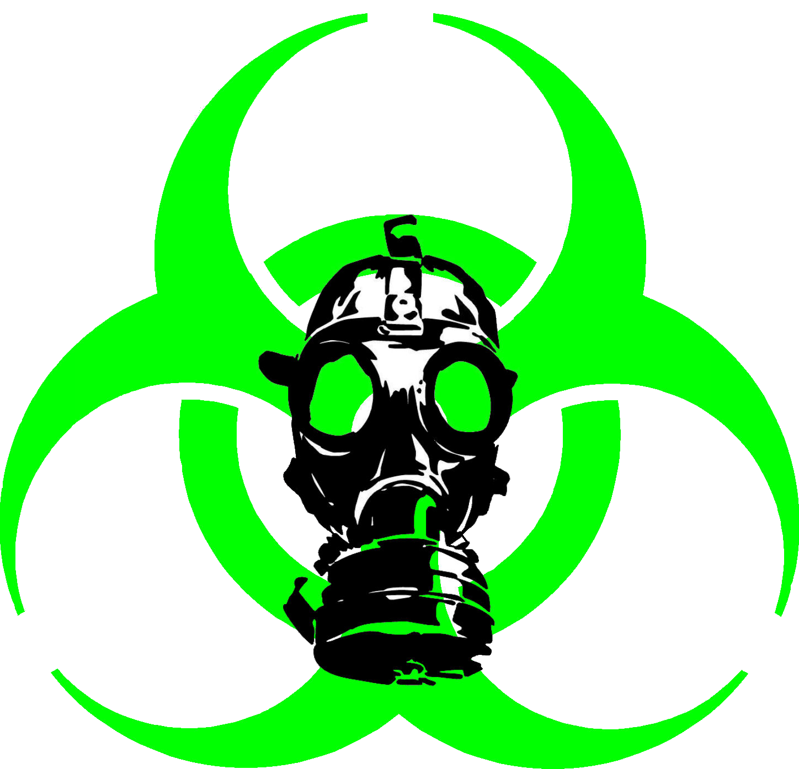

<!doctype html>
<html lang="en">
  <head>
    <!-- Required meta tags -->
    <meta charset="utf-8">
   <meta content="Dragon Squad is a hacking/dev squad !" name="description" />
    <meta content="Dragon Squad" name="author" />
	<meta http-equiv="X-UA-Compatible" content="IE=edge" />
	<meta content='width=device-width, initial-scale=1.0, shrink-to-fit=no' name='viewport' />
	<link rel="icon" href="assets/img/favicon.png" type="image/x-icon"/>

    <!-- Bootstrap CSS -->
    <link href="https://cdn.jsdelivr.net/npm/bootstrap@5.1.3/dist/css/bootstrap.min.css" rel="stylesheet" integrity="sha384-1BmE4kWBq78iYhFldvKuhfTAU6auU8tT94WrHftjDbrCEXSU1oBoqyl2QvZ6jIW3" crossorigin="anonymous">
    
    <!-- My CSS -->
    <link rel="stylesheet" href="assets/css/style.css">
    
    <!-- Bootstrap Icons -->
    <link rel="stylesheet" href="https://cdn.jsdelivr.net/npm/bootstrap-icons@1.7.2/font/bootstrap-icons.css">
    
    <!-- Google Fonts -->
    <link rel="preconnect" href="https://fonts.googleapis.com">
<link rel="preconnect" href="https://fonts.gstatic.com" crossorigin>
<link href="https://fonts.googleapis.com/css2?family=Inter:wght@100;300;500;700&display=swap" rel="stylesheet">

    <title>Dragon Squad | Portofolio</title>
  </head>
  <body>
<!-- Navbar -->

    <nav class="navbar navbar-expand-lg navbar-dark bg-acsent fixed-top shadow-lg">
  

    <a class="navbar-brand fw-bold fs-3" href="#">Dragon Squad</a>
    <button class="navbar-toggler" type="button" data-bs-toggle="collapse" data-bs-target="#navbarNavAltMarkup" aria-controls="navbarNavAltMarkup" aria-expanded="false" aria-label="Toggle navigation">
      
    </button>
    

      

        <a class="nav-link active" aria-current="page" href="#hero"><i class="bi bi-house-door"></i> | Home</a>
        <a class="nav-link" href="#about"><i class="bi bi-person-square"></i> | About</a>
      

    

  

</nav>				

<!-- End Navbar -->

<!-- Hero Section -->

<section id="hero">
	

		

			

				
					

					<h2>Hello,</h2>
					<h1 class="color-acsent">We are a Hacking/DEV squad</h1>
					
Hacktivist forever !

					
 <a class="btn btn-acsent text-white p-2" href="https://lolware95.github.io/dragonsquadtrophys"><svg xmlns="http://www.w3.org/2000/svg" width="16" height="16" fill="currentColor" class="bi bi-person-square" viewBox="0 0 16 16">
  <path d="M11 6a3 3 0 1 1-6 0 3 3 0 0 1 6 0z"/>
  <path d="M2 0a2 2 0 0 0-2 2v12a2 2 0 0 0 2 2h12a2 2 0 0 0 2-2V2a2 2 0 0 0-2-2H2zm12 1a1 1 0 0 1 1 1v12a1 1 0 0 1-1 1v-1c0-1-1-4-6-4s-6 3-6 4v1a1 1 0 0 1-1-1V2a1 1 0 0 1 1-1h12z"/>
</svg> Our Trophy's</a>
					

			
	
		
					
	
	

	<svg xmlns="http://www.w3.org/2000/svg" viewBox="0 0 1440 320"><path fill="#0F3260" fill-opacity="1" d="M0,96L48,101.3C96,107,192,117,288,117.3C384,117,480,107,576,112C672,117,768,139,864,154.7C960,171,1056,181,1152,170.7C1248,160,1344,128,1392,112L1440,96L1440,320L1392,320C1344,320,1248,320,1152,320C1056,320,960,320,864,320C768,320,672,320,576,320C480,320,384,320,288,320C192,320,96,320,48,320L0,320Z"></path></svg>
</section>

<!-- End Hero Section -->

<!-- About Section -->

<section id="about">
	

		

			

				

					<h1 class="fw-bold">About Me</h1>
				

				

				

					
We are an Hacking/DEV squad named Dragon Squad.
																	
				
	
				
				
					
We are some Hacktivistes acting for the humanity.

					

				
															
			
														
		
		
	

		
								
	

	<svg xmlns="http://www.w3.org/2000/svg" viewBox="0 0 1440 320"><path fill="#052145" fill-opacity="1" d="M0,64L48,58.7C96,53,192,43,288,58.7C384,75,480,117,576,133.3C672,149,768,139,864,117.3C960,96,1056,64,1152,58.7C1248,53,1344,75,1392,85.3L1440,96L1440,320L1392,320C1344,320,1248,320,1152,320C1056,320,960,320,864,320C768,320,672,320,576,320C480,320,384,320,288,320C192,320,96,320,48,320L0,320Z"></path></svg>
</section>

<!-- End About Section -->

<!-- Footer -->

<footer class="text-white text-center p-4">
	
Made <path fill-rule="evenodd" d="M8 1.314C12.438-3.248 23.534 4.735 8 15-7.534 4.736 3.562-3.248 8 1.314z"/> </svg> by	<a  class="text-white fw-bold" href="https://lolware95.github.io/portofolio/">LolWare93</a>
	
</footer>

<!-- End Footer -->

    <!-- Optional JavaScript; choose one of the two! -->

    <!-- Option 1: Bootstrap Bundle with Popper -->
    
  </body>
</html>
